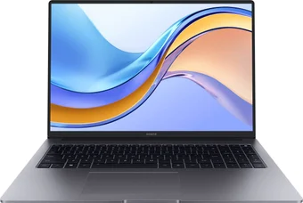
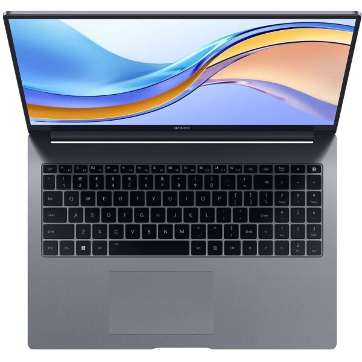
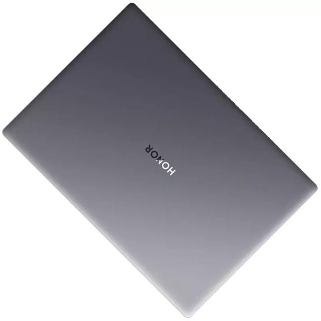

# 1. Laptop name

Honor MagicBook X 16 2024 (BRN-F56)

# 2. Laptop description

Sleek and powerful laptop designed for seamless multitasking, productivity, and an immersive user experience.

# 3. Specifications

- **Model name:** BRN-F56
- **Screen:** 16.0" 1920 x 1200, IPS 60hz
- **Processor:** Intel Core i5 12450H
- **Ram:** 16GB LPDDR4X
- **SSD:** 512 GB
- **Video:** Integrated Videocard
- **Color:** Dark-gray
- **Battery:** 42w/h

# 4. Photos

# 5. Similar devices

1. Lenovo ThinkPad Z16 Gen 2
2. Huawei MateBook D16
3. Lenovo LOQ 15IAX9
4. Dell Inspiron 16 5620
5. HP Pavilion 16-a0097nr
